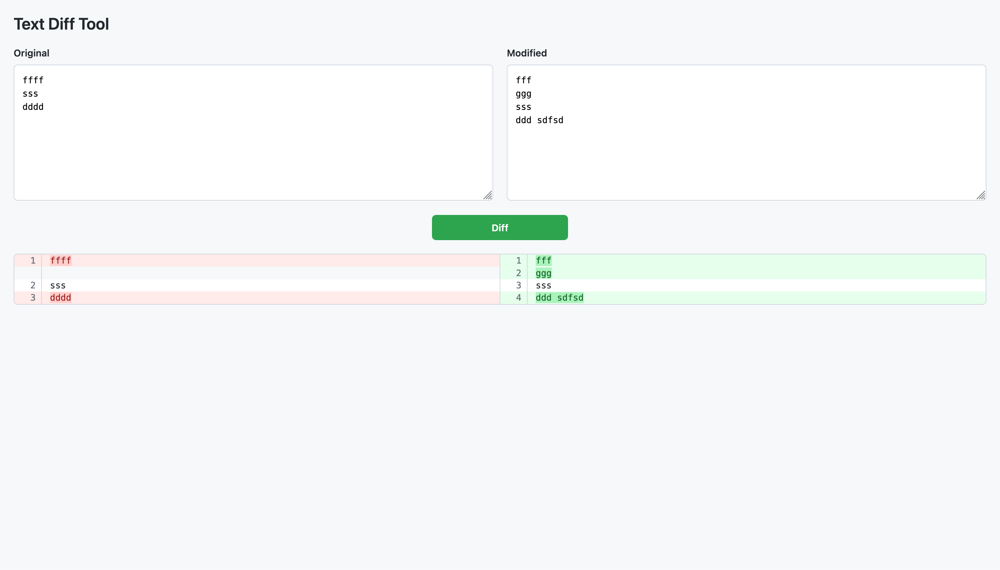

# Browser Diff

A simple offline text diff tool. Open `index.html` in a browser.

Paste text or drop files into the two boxes, click Diff.

## Developing

- `app.js` - `renderSplitDiff()` uses jsdiff's `diffLines()` then pairs adjacent removed/added blocks side-by-side
- `styles.css` - table-based layout with fixed columns for line numbers
- `diff.js` - bundled [jsdiff](https://github.com/kpdecker/jsdiff) library (v8.0.3)
- `test.html` - open in browser to run tests; uses inline `<script>` assertions against `renderSplitDiff()`
